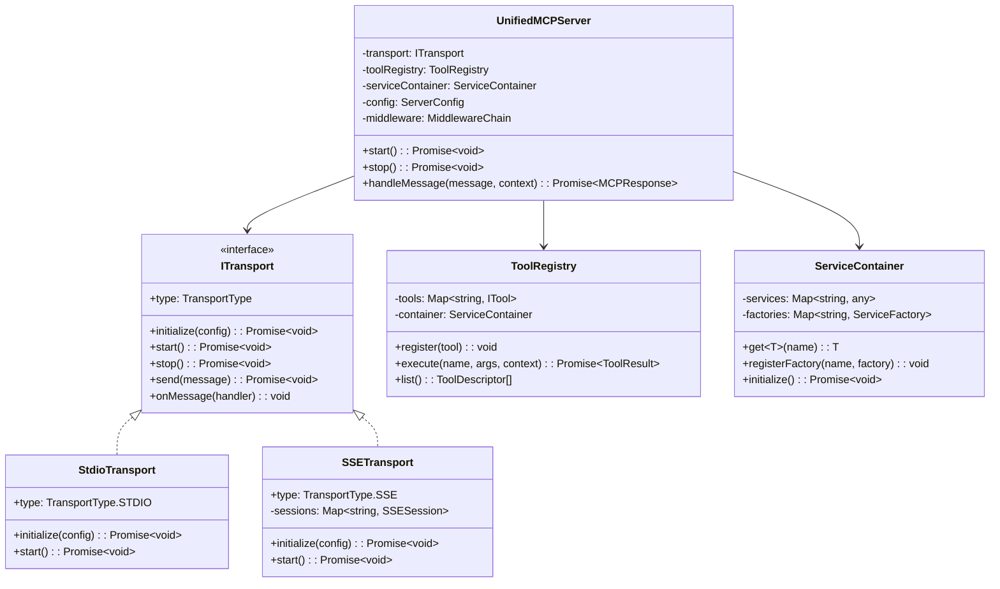
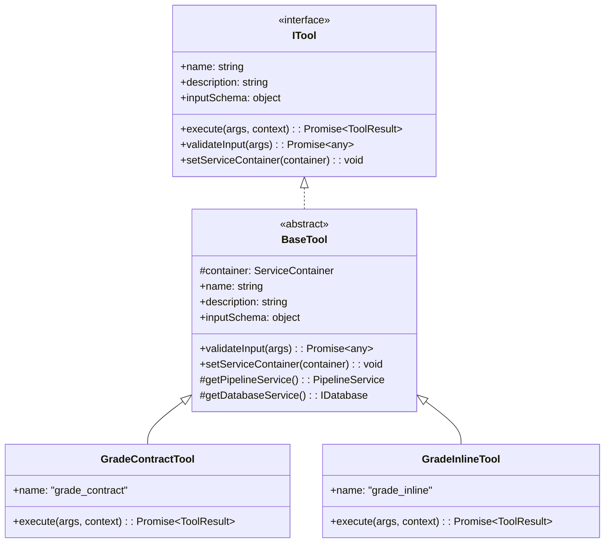
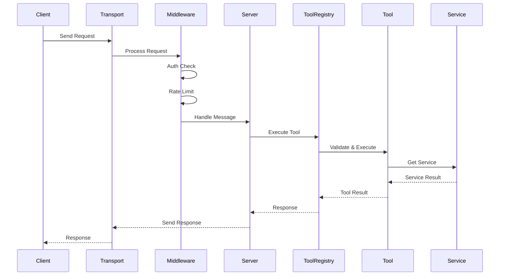
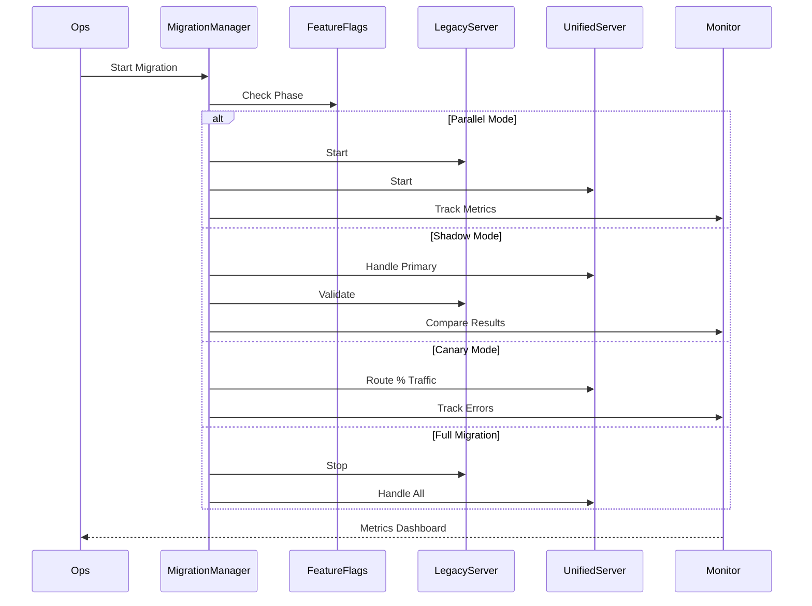

# Unified Server Architecture Design Document

## Executive Summary

This document outlines the architectural design for consolidating 4 existing server implementations into a unified, maintainable, and extensible solution. The new architecture follows SOLID principles, uses dependency injection, and implements clean separation of concerns through well-defined abstractions.

## Current State Analysis

### Existing Implementations
1. **server.ts** - STDIO transport for MCP/Qodo integration
2. **server-sse.ts** - SSE with SDK, includes authentication
3. **server-sse-simple.ts** - Manual SSE implementation with session support
4. **server-sse-direct.ts** - Direct SSE implementation without SDK

### Common Patterns Identified
- All servers register the same 8 tools
- Tool handlers delegate to pipeline module
- SSE servers include authentication middleware
- Database operations are optional (SQLite/PostgreSQL)
- Progress tracking mechanism exists but varies

### Technical Debt
- Code duplication across implementations
- Inconsistent error handling
- Different authentication approaches
- Mixed concerns (transport + business logic)
- No unified configuration management

## Proposed Architecture

### Core Design Principles
1. **Single Responsibility** - Each class has one reason to change
2. **Open/Closed** - Open for extension, closed for modification
3. **Liskov Substitution** - Transport implementations are interchangeable
4. **Interface Segregation** - Clients depend only on what they use
5. **Dependency Inversion** - Depend on abstractions, not concretions

### High-Level Architecture

```
┌─────────────────────────────────────────────────────────┐
│                    Application Layer                     │
├───────────────────────────────────────────────────────────┤
│                   UnifiedMCPServer                       │
│  ┌──────────────┐  ┌──────────────┐  ┌──────────────┐  │
│  │   Transport  │  │     Tool     │  │   Service    │  │
│  │   Manager    │  │   Registry   │  │  Container   │  │
│  └──────────────┘  └──────────────┘  └──────────────┘  │
├───────────────────────────────────────────────────────────┤
│                    Transport Layer                       │
│  ┌──────────────┐  ┌──────────────┐  ┌──────────────┐  │
│  │    STDIO     │  │     SSE      │  │   WebSocket  │  │
│  │   Transport  │  │  Transport   │  │  Transport   │  │
│  └──────────────┘  └──────────────┘  └──────────────┘  │
├───────────────────────────────────────────────────────────┤
│                    Services Layer                        │
│  ┌──────────────┐  ┌──────────────┐  ┌──────────────┐  │
│  │     Auth     │  │   Database   │  │   Pipeline   │  │
│  │   Service    │  │   Service    │  │   Service    │  │
│  └──────────────┘  └──────────────┘  └──────────────┘  │
└───────────────────────────────────────────────────────────┘
```

## Detailed Design

### 1. Transport Abstraction Layer

```typescript
// src/mcp/transports/ITransport.ts
export interface ITransport {
  readonly type: TransportType;
  initialize(config: TransportConfig): Promise<void>;
  start(): Promise<void>;
  stop(): Promise<void>;
  send(message: MCPMessage): Promise<void>;
  onMessage(handler: MessageHandler): void;
  onError(handler: ErrorHandler): void;
  onClose(handler: CloseHandler): void;
}

export enum TransportType {
  STDIO = 'stdio',
  SSE = 'sse',
  SSE_SIMPLE = 'sse-simple',
  WEBSOCKET = 'websocket'
}

export interface TransportConfig {
  type: TransportType;
  auth?: AuthConfig;
  cors?: CorsConfig;
  port?: number;
  host?: string;
  ssl?: SSLConfig;
  sessionConfig?: SessionConfig;
}
```

### 2. Unified Server Class

```typescript
// src/mcp/UnifiedMCPServer.ts
export class UnifiedMCPServer {
  private transport: ITransport;
  private toolRegistry: ToolRegistry;
  private serviceContainer: ServiceContainer;
  private config: ServerConfig;
  private middleware: MiddlewareChain;

  constructor(config: ServerConfig) {
    this.config = config;
    this.serviceContainer = new ServiceContainer(config);
    this.toolRegistry = new ToolRegistry(this.serviceContainer);
    this.transport = TransportFactory.create(config.transport);
    this.middleware = new MiddlewareChain();
    
    this.setupMiddleware();
    this.registerTools();
  }

  private setupMiddleware(): void {
    if (this.config.auth?.enabled) {
      this.middleware.use(new AuthenticationMiddleware(
        this.serviceContainer.get('authService')
      ));
    }
    
    if (this.config.rateLimit?.enabled) {
      this.middleware.use(new RateLimitMiddleware(
        this.config.rateLimit
      ));
    }
    
    this.middleware.use(new LoggingMiddleware());
    this.middleware.use(new ErrorHandlingMiddleware());
  }

  private registerTools(): void {
    // Register all 8 tools with unified signatures
    const tools = [
      new VersionTool(),
      new ListCheckpointsTool(),
      new GradeContractTool(),
      new GradeInlineTool(),
      new GradeAndRecordTool(),
      new ExplainFindingTool(),
      new SuggestFixesTool(),
      new GetApiHistoryTool()
    ];

    tools.forEach(tool => {
      this.toolRegistry.register(tool);
    });
  }

  async start(): Promise<void> {
    await this.serviceContainer.initialize();
    await this.transport.initialize(this.config.transport);
    
    this.transport.onMessage(async (message) => {
      const context = await this.middleware.process(message);
      const response = await this.handleMessage(message, context);
      await this.transport.send(response);
    });

    await this.transport.start();
  }

  private async handleMessage(
    message: MCPMessage, 
    context: RequestContext
  ): Promise<MCPResponse> {
    switch (message.method) {
      case 'initialize':
        return this.handleInitialize(message);
      case 'tools/list':
        return this.handleListTools();
      case 'tools/call':
        return this.handleToolCall(message, context);
      default:
        throw new MethodNotFoundError(message.method);
    }
  }
}
```

### 3. Service Container (Dependency Injection)

```typescript
// src/mcp/services/ServiceContainer.ts
export class ServiceContainer {
  private services: Map<string, any> = new Map();
  private factories: Map<string, ServiceFactory> = new Map();
  
  constructor(config: ServerConfig) {
    this.registerCoreServices(config);
  }

  private registerCoreServices(config: ServerConfig): void {
    // Register service factories
    this.registerFactory('database', () => 
      DatabaseFactory.create(config.database)
    );
    
    this.registerFactory('authService', () => 
      new AuthService(config.auth, this.get('database'))
    );
    
    this.registerFactory('pipelineService', () => 
      new PipelineService(config.pipeline)
    );
    
    this.registerFactory('progressTracker', () => 
      new ProgressTracker(config.progress)
    );
    
    this.registerFactory('cache', () => 
      CacheFactory.create(config.cache)
    );
  }

  registerFactory(name: string, factory: ServiceFactory): void {
    this.factories.set(name, factory);
  }

  get<T>(name: string): T {
    if (!this.services.has(name)) {
      const factory = this.factories.get(name);
      if (!factory) {
        throw new ServiceNotFoundError(name);
      }
      this.services.set(name, factory());
    }
    return this.services.get(name);
  }

  async initialize(): Promise<void> {
    // Initialize services that need async setup
    const db = this.get<IDatabase>('database');
    if (db) {
      await db.connect();
      await db.migrate();
    }
  }
}
```

### 4. Tool Registry with Strategy Pattern

```typescript
// src/mcp/tools/ToolRegistry.ts
export class ToolRegistry {
  private tools: Map<string, ITool> = new Map();
  private container: ServiceContainer;

  constructor(container: ServiceContainer) {
    this.container = container;
  }

  register(tool: ITool): void {
    tool.setServiceContainer(this.container);
    this.tools.set(tool.name, tool);
  }

  async execute(
    name: string, 
    args: any, 
    context: RequestContext
  ): Promise<ToolResult> {
    const tool = this.tools.get(name);
    if (!tool) {
      throw new ToolNotFoundError(name);
    }

    // Validate input
    const validatedArgs = await tool.validateInput(args);
    
    // Execute with context
    const result = await tool.execute(validatedArgs, context);
    
    // Track usage if authenticated
    if (context.user) {
      await this.trackUsage(context.user.teamId, name);
    }
    
    return result;
  }

  list(): ToolDescriptor[] {
    return Array.from(this.tools.values()).map(tool => ({
      name: tool.name,
      description: tool.description,
      inputSchema: tool.inputSchema
    }));
  }
}
```

### 5. Transport Implementations

```typescript
// src/mcp/transports/StdioTransport.ts
export class StdioTransport implements ITransport {
  readonly type = TransportType.STDIO;
  private mcpServer?: McpServer;
  private transport?: StdioServerTransport;

  async initialize(config: TransportConfig): Promise<void> {
    this.mcpServer = new McpServer({
      name: config.serverName || 'unified-mcp-server',
      version: config.version || '2.0.0'
    });
    this.transport = new StdioServerTransport();
  }

  async start(): Promise<void> {
    if (!this.mcpServer || !this.transport) {
      throw new Error('Transport not initialized');
    }
    await this.mcpServer.connect(this.transport);
  }

  // ... other methods
}

// src/mcp/transports/SSETransport.ts
export class SSETransport implements ITransport {
  readonly type = TransportType.SSE;
  private app?: express.Application;
  private server?: http.Server;
  private sessions: Map<string, SSESession> = new Map();

  async initialize(config: TransportConfig): Promise<void> {
    this.app = express();
    this.setupMiddleware(config);
    this.setupRoutes(config);
  }

  private setupRoutes(config: TransportConfig): void {
    // Health check
    this.app.get('/health', (req, res) => {
      res.json({ status: 'healthy', transport: 'sse' });
    });

    // SSE endpoint with GET session support
    this.app.get('/sse', async (req, res) => {
      const session = this.createSession(req, res);
      this.sessions.set(session.id, session);
      this.initializeSSE(res, session);
    });

    // POST messages to session
    this.app.post('/sse/message', async (req, res) => {
      const sessionId = req.query.session as string;
      const session = this.sessions.get(sessionId);
      if (!session) {
        return res.status(404).json({ error: 'Session not found' });
      }
      await this.handleMessage(req.body, session);
      res.json({ ok: true });
    });
  }

  // ... other methods
}
```

### 6. Configuration Schema

```typescript
// src/mcp/config/ServerConfig.ts
export interface ServerConfig {
  transport: TransportConfig;
  database?: DatabaseConfig;
  auth?: AuthConfig;
  rateLimit?: RateLimitConfig;
  cache?: CacheConfig;
  pipeline?: PipelineConfig;
  progress?: ProgressConfig;
  logging?: LoggingConfig;
  monitoring?: MonitoringConfig;
}

export interface DatabaseConfig {
  type: 'sqlite' | 'postgresql' | 'memory';
  connectionString?: string;
  pool?: PoolConfig;
  migrations?: MigrationConfig;
}

export interface AuthConfig {
  enabled: boolean;
  provider: 'apikey' | 'jwt' | 'oauth';
  keys?: ApiKeyConfig;
  jwt?: JWTConfig;
  oauth?: OAuthConfig;
}

// Configuration loader with validation
export class ConfigLoader {
  static load(source: ConfigSource): ServerConfig {
    const raw = this.loadRaw(source);
    const validated = this.validate(raw);
    const withDefaults = this.applyDefaults(validated);
    return this.resolveEnvironment(withDefaults);
  }

  private static validate(config: any): ServerConfig {
    const schema = z.object({
      transport: TransportConfigSchema,
      database: DatabaseConfigSchema.optional(),
      auth: AuthConfigSchema.optional(),
      // ... other schemas
    });
    
    return schema.parse(config);
  }
}
```

### 7. Migration Strategy

```typescript
// src/mcp/migration/MigrationManager.ts
export class MigrationManager {
  private featureFlags: FeatureFlags;
  private legacyServers: Map<string, any>;
  
  constructor() {
    this.featureFlags = new FeatureFlags();
    this.legacyServers = new Map();
  }

  async migrate(config: MigrationConfig): Promise<void> {
    // Phase 1: Run in parallel mode
    if (this.featureFlags.isEnabled('parallel_mode')) {
      await this.runParallelMode(config);
    }
    
    // Phase 2: Shadow mode - new server handles, old validates
    if (this.featureFlags.isEnabled('shadow_mode')) {
      await this.runShadowMode(config);
    }
    
    // Phase 3: Canary deployment
    if (this.featureFlags.isEnabled('canary')) {
      await this.runCanaryMode(config);
    }
    
    // Phase 4: Full migration
    if (this.featureFlags.isEnabled('full_migration')) {
      await this.runFullMigration(config);
    }
  }

  private async runParallelMode(config: MigrationConfig): Promise<void> {
    // Start both old and new servers
    const legacy = await this.startLegacyServer(config.legacy);
    const unified = await this.startUnifiedServer(config.unified);
    
    // Route traffic based on header or percentage
    const router = new TrafficRouter();
    router.route({
      legacy: config.trafficSplit.legacy,
      unified: config.trafficSplit.unified
    });
  }
}
```

## Class Diagrams

### Core Server Architecture



### Tool Architecture



## Sequence Diagrams

### Request Processing Flow



### Migration Flow



## Configuration Examples

### Basic STDIO Configuration

```yaml
# config/stdio.yaml
transport:
  type: stdio
  
database:
  type: sqlite
  connectionString: file:grader.sqlite
  
pipeline:
  templatePath: /app/templates/MASTER_API_TEMPLATE_v3.yaml
  
logging:
  level: info
  format: json
```

### Production SSE Configuration

```yaml
# config/production.yaml
transport:
  type: sse
  port: 3000
  host: 0.0.0.0
  cors:
    origins:
      - https://app.example.com
    credentials: true
  ssl:
    cert: /etc/ssl/cert.pem
    key: /etc/ssl/key.pem

auth:
  enabled: true
  provider: apikey
  keys:
    source: database
    cache: redis

database:
  type: postgresql
  connectionString: ${DATABASE_URL}
  pool:
    max: 20
    idle: 10000
  migrations:
    auto: true
    directory: /app/migrations

rateLimit:
  enabled: true
  window: 60000
  max: 100
  
cache:
  type: redis
  url: ${REDIS_URL}
  ttl: 3600

monitoring:
  enabled: true
  provider: prometheus
  metrics:
    - request_duration
    - tool_usage
    - error_rate
```

### Development Configuration

```yaml
# config/development.yaml
transport:
  type: sse-simple
  port: 3001
  
auth:
  enabled: false
  
database:
  type: memory
  
logging:
  level: debug
  format: pretty
```

## Migration Plan

### Phase 1: Preparation (Week 1-2)
1. **Code Analysis** ✓ Complete
2. **Architecture Design** ✓ Complete
3. **Create base abstractions**
   - ITransport interface
   - ITool interface
   - Service interfaces
4. **Setup test infrastructure**
   - Unit test templates
   - Integration test harness
   - Performance benchmarks

### Phase 2: Implementation (Week 3-6)
1. **Core Framework**
   - UnifiedMCPServer class
   - ServiceContainer
   - ToolRegistry
   - Middleware chain
2. **Transport Adapters**
   - StdioTransport
   - SSETransport
   - SSESimpleTransport
3. **Tool Implementations**
   - Migrate all 8 tools
   - Unified error handling
   - Progress tracking
4. **Service Layer**
   - AuthService
   - DatabaseService
   - PipelineService

### Phase 3: Testing (Week 7-8)
1. **Unit Tests**
   - 100% coverage for new code
   - Mock all dependencies
2. **Integration Tests**
   - End-to-end scenarios
   - Transport compatibility
   - Database operations
3. **Performance Tests**
   - Load testing
   - Memory profiling
   - Latency measurements
4. **Compatibility Tests**
   - Existing client compatibility
   - API contract validation

### Phase 4: Migration (Week 9-10)
1. **Parallel Deployment**
   - Deploy unified server alongside legacy
   - Route 10% traffic to new server
   - Monitor metrics and errors
2. **Gradual Rollout**
   - Increase traffic to 25%, 50%, 75%
   - Validate at each stage
   - Rollback plan ready
3. **Full Migration**
   - Switch 100% traffic
   - Keep legacy servers as backup
   - Monitor for 48 hours
4. **Cleanup**
   - Remove legacy code
   - Update documentation
   - Archive old implementations

### Feature Flags

```typescript
export enum FeatureFlag {
  UNIFIED_SERVER = 'unified_server',
  PARALLEL_MODE = 'parallel_mode',
  SHADOW_MODE = 'shadow_mode',
  CANARY_DEPLOYMENT = 'canary_deployment',
  NEW_AUTH_SYSTEM = 'new_auth_system',
  POSTGRES_MIGRATION = 'postgres_migration',
  ADVANCED_MONITORING = 'advanced_monitoring'
}

// Usage
if (featureFlags.isEnabled(FeatureFlag.UNIFIED_SERVER)) {
  return new UnifiedMCPServer(config);
} else {
  return new LegacyServer(config);
}
```

## Test Strategy

### 1. Unit Testing

```typescript
// test/unit/UnifiedMCPServer.test.ts
describe('UnifiedMCPServer', () => {
  let server: UnifiedMCPServer;
  let mockTransport: jest.Mocked<ITransport>;
  let mockContainer: jest.Mocked<ServiceContainer>;

  beforeEach(() => {
    mockTransport = createMockTransport();
    mockContainer = createMockContainer();
    server = new UnifiedMCPServer({
      transport: { type: TransportType.STDIO },
      // ... config
    });
  });

  describe('initialization', () => {
    it('should initialize all services', async () => {
      await server.start();
      expect(mockContainer.initialize).toHaveBeenCalled();
    });

    it('should register all tools', async () => {
      await server.start();
      const tools = server.getToolRegistry().list();
      expect(tools).toHaveLength(8);
    });
  });

  describe('message handling', () => {
    it('should handle initialize message', async () => {
      const response = await server.handleMessage({
        method: 'initialize',
        params: {}
      });
      expect(response.result).toHaveProperty('protocolVersion');
    });
  });
});
```

### 2. Integration Testing

```typescript
// test/integration/transport-compatibility.test.ts
describe('Transport Compatibility', () => {
  const transports = [
    TransportType.STDIO,
    TransportType.SSE,
    TransportType.SSE_SIMPLE
  ];

  transports.forEach(transportType => {
    describe(`${transportType} transport`, () => {
      let server: UnifiedMCPServer;
      let client: TestClient;

      beforeEach(async () => {
        server = new UnifiedMCPServer({
          transport: { type: transportType, port: 0 }
        });
        await server.start();
        client = new TestClient(server.getAddress());
      });

      it('should handle full tool lifecycle', async () => {
        // Initialize
        await client.initialize();
        
        // List tools
        const tools = await client.listTools();
        expect(tools).toHaveLength(8);
        
        // Execute tool
        const result = await client.executeTool('version', {});
        expect(result).toHaveProperty('version');
      });
    });
  });
});
```

### 3. Performance Testing

```typescript
// test/performance/load.test.ts
describe('Load Testing', () => {
  it('should handle 1000 concurrent requests', async () => {
    const server = new UnifiedMCPServer(config);
    await server.start();
    
    const promises = [];
    for (let i = 0; i < 1000; i++) {
      promises.push(client.executeTool('version', {}));
    }
    
    const start = Date.now();
    await Promise.all(promises);
    const duration = Date.now() - start;
    
    expect(duration).toBeLessThan(5000); // 5 seconds
  });
});
```

## Monitoring and Observability

### Metrics to Track

```typescript
export class MetricsCollector {
  private prometheus = new PrometheusClient();
  
  // Request metrics
  requestDuration = new Histogram({
    name: 'mcp_request_duration_seconds',
    help: 'Request duration in seconds',
    labelNames: ['method', 'transport', 'status']
  });
  
  // Tool metrics
  toolExecutions = new Counter({
    name: 'mcp_tool_executions_total',
    help: 'Total tool executions',
    labelNames: ['tool', 'team', 'status']
  });
  
  // Transport metrics
  activeConnections = new Gauge({
    name: 'mcp_active_connections',
    help: 'Number of active connections',
    labelNames: ['transport']
  });
  
  // Error metrics
  errors = new Counter({
    name: 'mcp_errors_total',
    help: 'Total errors',
    labelNames: ['type', 'transport', 'tool']
  });
}
```

### Health Checks

```typescript
export class HealthChecker {
  async check(): Promise<HealthStatus> {
    const checks = await Promise.all([
      this.checkDatabase(),
      this.checkCache(),
      this.checkPipeline(),
      this.checkMemory()
    ]);
    
    return {
      status: checks.every(c => c.healthy) ? 'healthy' : 'unhealthy',
      checks,
      timestamp: new Date().toISOString()
    };
  }
  
  private async checkDatabase(): Promise<CheckResult> {
    try {
      const db = this.container.get<IDatabase>('database');
      await db.query('SELECT 1');
      return { name: 'database', healthy: true };
    } catch (error) {
      return { name: 'database', healthy: false, error };
    }
  }
}
```

## Security Considerations

### Authentication Flow

```typescript
export class AuthenticationMiddleware implements IMiddleware {
  async process(
    request: MCPRequest, 
    next: MiddlewareNext
  ): Promise<MCPResponse> {
    // Extract credentials
    const credentials = this.extractCredentials(request);
    
    // Validate
    const user = await this.authService.validate(credentials);
    if (!user) {
      throw new UnauthorizedError();
    }
    
    // Check rate limits
    if (await this.isRateLimited(user)) {
      throw new RateLimitError();
    }
    
    // Add to context
    request.context.user = user;
    
    return next(request);
  }
}
```

### API Key Rotation

```typescript
export class ApiKeyRotation {
  async rotate(teamId: string): Promise<RotationResult> {
    // Generate new key
    const newKey = this.generateKey();
    
    // Store with grace period
    await this.store.addKey(teamId, newKey, {
      expiresIn: '30d',
      gracePeriod: '7d'
    });
    
    // Notify team
    await this.notifier.sendRotationNotice(teamId, newKey);
    
    return { newKey, oldKeyValidUntil: this.getGracePeriodEnd() };
  }
}
```

## Error Handling Strategy

### Unified Error Hierarchy

```typescript
export class MCPError extends Error {
  constructor(
    public code: string,
    public message: string,
    public statusCode: number,
    public details?: any
  ) {
    super(message);
  }
}

export class ValidationError extends MCPError {
  constructor(message: string, details?: any) {
    super('VALIDATION_ERROR', message, 400, details);
  }
}

export class AuthenticationError extends MCPError {
  constructor(message = 'Authentication required') {
    super('AUTH_ERROR', message, 401);
  }
}

export class ToolExecutionError extends MCPError {
  constructor(tool: string, error: Error) {
    super('TOOL_ERROR', `Tool ${tool} failed: ${error.message}`, 500, {
      tool,
      originalError: error.message
    });
  }
}
```

### Circuit Breaker for External Services

```typescript
export class CircuitBreaker {
  private failures = 0;
  private lastFailure?: Date;
  private state: 'closed' | 'open' | 'half-open' = 'closed';
  
  async execute<T>(fn: () => Promise<T>): Promise<T> {
    if (this.state === 'open') {
      if (this.shouldAttemptReset()) {
        this.state = 'half-open';
      } else {
        throw new CircuitOpenError();
      }
    }
    
    try {
      const result = await fn();
      this.onSuccess();
      return result;
    } catch (error) {
      this.onFailure();
      throw error;
    }
  }
  
  private onFailure(): void {
    this.failures++;
    this.lastFailure = new Date();
    if (this.failures >= this.threshold) {
      this.state = 'open';
    }
  }
  
  private onSuccess(): void {
    this.failures = 0;
    this.state = 'closed';
  }
}
```

## Deployment Configuration

### Docker Compose for Development

```yaml
version: '3.8'

services:
  unified-server:
    build: .
    ports:
      - "3000:3000"
    environment:
      - NODE_ENV=development
      - CONFIG_PATH=/app/config/development.yaml
    volumes:
      - ./src:/app/src
      - ./config:/app/config
    depends_on:
      - postgres
      - redis
  
  postgres:
    image: postgres:15
    environment:
      - POSTGRES_DB=grader
      - POSTGRES_USER=grader
      - POSTGRES_PASSWORD=secret
    volumes:
      - postgres_data:/var/lib/postgresql/data
  
  redis:
    image: redis:7
    command: redis-server --appendonly yes
    volumes:
      - redis_data:/data

volumes:
  postgres_data:
  redis_data:
```

### Kubernetes Deployment

```yaml
apiVersion: apps/v1
kind: Deployment
metadata:
  name: unified-mcp-server
spec:
  replicas: 3
  selector:
    matchLabels:
      app: unified-mcp-server
  template:
    metadata:
      labels:
        app: unified-mcp-server
    spec:
      containers:
      - name: server
        image: unified-mcp-server:2.0.0
        ports:
        - containerPort: 3000
        env:
        - name: NODE_ENV
          value: production
        - name: CONFIG_PATH
          value: /app/config/production.yaml
        resources:
          requests:
            memory: "256Mi"
            cpu: "250m"
          limits:
            memory: "512Mi"
            cpu: "500m"
        livenessProbe:
          httpGet:
            path: /health
            port: 3000
          initialDelaySeconds: 30
          periodSeconds: 10
        readinessProbe:
          httpGet:
            path: /health
            port: 3000
          initialDelaySeconds: 5
          periodSeconds: 5
```

## Success Metrics

### Technical Metrics
- **Code Reduction**: Target 60% less code through consolidation
- **Test Coverage**: Maintain >90% coverage
- **Performance**: <100ms p99 latency for tool execution
- **Availability**: 99.9% uptime SLA
- **Memory**: <256MB baseline memory usage

### Business Metrics
- **Development Velocity**: 50% faster feature development
- **Bug Rate**: 75% reduction in transport-related bugs
- **Deployment Time**: From hours to minutes
- **Maintenance Effort**: 70% reduction in maintenance hours

## Risk Mitigation

### Identified Risks

1. **Breaking Changes**
   - Mitigation: Comprehensive compatibility testing
   - Fallback: Parallel deployment with instant rollback

2. **Performance Regression**
   - Mitigation: Continuous performance monitoring
   - Fallback: Optimization hotspots identified pre-deployment

3. **Data Loss**
   - Mitigation: Database migration with full backup
   - Fallback: Point-in-time recovery capability

4. **Client Incompatibility**
   - Mitigation: Versioned API with backward compatibility
   - Fallback: Legacy endpoint support for 6 months

## Conclusion

This unified architecture provides:
- **Maintainability** through clean separation of concerns
- **Extensibility** via plugin architecture and DI
- **Reliability** with comprehensive error handling
- **Performance** through optimized resource usage
- **Observability** with built-in monitoring

The phased migration approach ensures zero downtime and provides multiple rollback points, making this a low-risk, high-reward architectural improvement.

## Next Steps

1. Review and approve architecture
2. Create implementation tickets
3. Set up CI/CD pipelines
4. Begin Phase 1 implementation
5. Schedule stakeholder demos

---

*Document Version: 1.0.0*  
*Last Updated: 2025-01-10*  
*Author: Architecture Team*  
*Status: Draft - Pending Review*